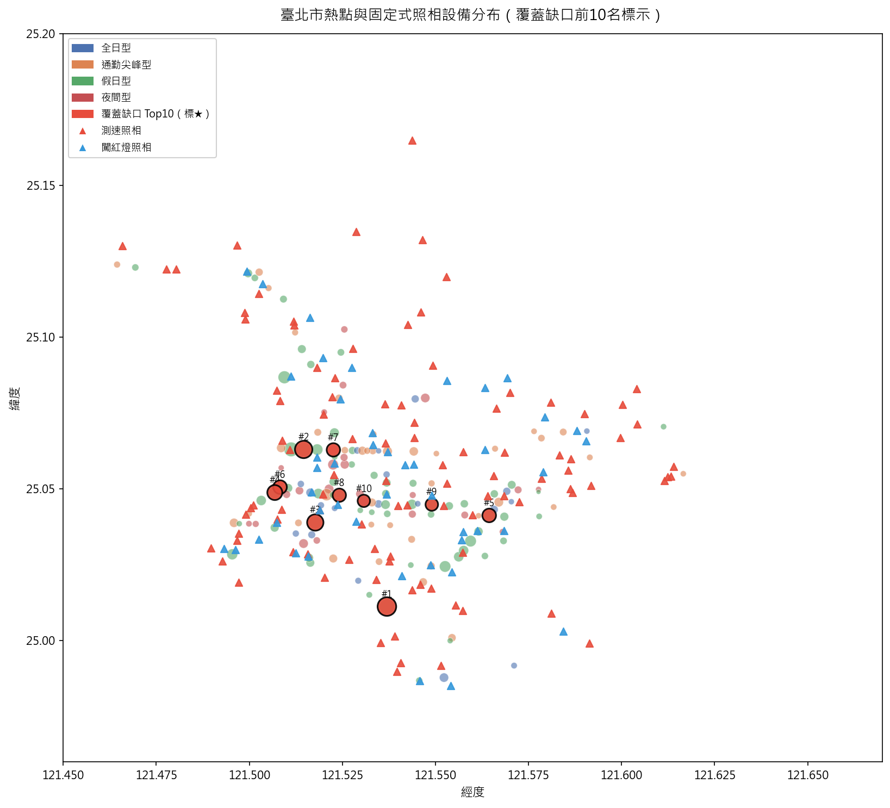
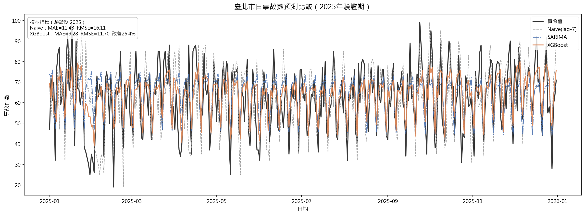

# 臺北市道路交通事故熱點風險預測與照相設備設置建議系統

> **大數據分析期末專題（114-2）** | Python 資料分析管線 | 臺北市政府開放資料



*圖：臺北市 145 個事故熱點分布與固定式照相設備現況。紅色標記（★）為覆蓋缺口前 10 名建議優先設置地點，圓圈大小代表五年累積事故件數。*

---

## 專案摘要

本系統對臺北市 2021–2025 年共 **118,980 筆**交通事故資料進行全面分析，透過空間群聚演算法找出 **145 個事故熱點**，並以時間序列預測模型預測未來事故趨勢，最終產出**照相設備設置建議清單**，協助主管機關在資源有限的情況下優先選址、提升道路交通安全。

### 核心成果

| 指標 | 數值 |
|---|---|
| 分析事故資料 | 118,980 筆（2021–2025 年，A1+A2） |
| 辨識空間熱點 | **145 個**（DBSCAN，eps=50m） |
| 熱點內事故占比 | **19.2%**（事故高度集中） |
| 覆蓋缺口熱點 | **87 個**（300m 內無任何設備） |
| 建議優先設置 | **前 10 名**地點（最高：539 件，距設備 915m） |
| 預測模型精度 | XGBoost MAE=**9.275**（相較 Naive 改善 **25.4%**） |

---

## 分析流程（From Hotspots to Predictions to Recommendations）

```
原始資料（政府開放資料）
     │
     ▼
① 資料清理（s01）          ── 118,980 筆，longitude/latitude（kepler.gl 相容）
     │
     ▼
② 空間熱點辨識（s02）       ── DBSCAN → 145 個熱點，haversine 距離計算
     │
     ▼
③ 時間序列化（s03）         ── 日序列 1,826 天、熱點月 panel 145×60
     │
     ▼
④ 特徵萃取（s04）           ── lag/MA/星期/COVID dummy，shift() 防洩漏
     │
     ▼
⑤ 熱點分群（s05）           ── PCA + K-means(k=8) → 4 種型態
     │
     ▼
⑥ 預測建模（s06）           ── Naive / SARIMA / XGBoost / 全域熱點月模型
     │
     ▼
⑦ 建議清單（s07）           ── 覆蓋缺口篩選 → 依風險排序前 10 名
     │
     ▼
⑧ 視覺化（s08）             ── F1~F6 PNG（≥150dpi）+ F2 folium 互動地圖
```

---

## 預測模型結果



*圖：2025 年全年（驗證期）各模型預測值 vs 實際值。SARIMA 與 XGBoost 均能有效捕捉日事故數的週週期性與趨勢變化。*

| 模型 | MAE | RMSE | vs Naive 改善率 |
|---|---|---|---|
| Naive（lag-7 基準） | 12.433 | 16.110 | — |
| SARIMA(1,1,2)(1,0,1,7) | **9.154** | **12.051** | **+26.4%** |
| XGBoost（全特徵） | 9.275 | 11.702 | +25.4% |
| 熱點月 XGBoost（全域） | 1.301 | 1.702 | — |

> 訓練期：2021-01-29 ~ 2024-12-31（1,433 天）  
> 驗證期：2025-01-01 ~ 2025-12-31（365 天）  
> 切分方式：嚴格時序切分，不隨機抽樣（防止未來資訊洩漏）

---

## 熱點型態分類

透過 PCA 降維後 K-means 分群（k=8），將 145 個熱點合併為 4 種時間行為型態：

| 型態 | 熱點數 | 事故時間特徵 | 建議設備 |
|---|---|---|---|
| 🔵 全日型 | 60（41%） | 事故分布相對平坦 | 綜合評估（A1 數加權） |
| 🟠 通勤尖峰型 | 40（28%） | 早 7–9 時 + 晚 17–19 時雙峰 | 闖紅燈照相 / 路口科技執法 |
| 🟢 假日型 | 25（17%） | 週末占比相對偏高 | 行人安全導向科技執法 |
| 🔴 夜間型 | 20（14%） | 深夜 22 時–凌晨 3 時占比高 | 測速照相 |

---

## 前 10 名設置建議清單

> 篩選條件：300m 內無任何固定式照相設備（覆蓋缺口）且事故件數最高

| 排名 | 地點 | 五年件數 | A1 | 最近設備 | 型態 | 建議設備 |
|---|---|---|---|---|---|---|
| **1** | 中正區羅斯福路4段與基隆路4段口 | **539** | 1 | 915m | 全日型 | 綜合評估 |
| 2 | 大安區新生南路與信義路口 | 469 | 1 | 380m | 全日型 | 綜合評估 |
| 3 | 信義區忠孝東路與光復南路口 | 415 | 0 | 469m | 全日型 | 綜合評估 |
| 4 | 士林區中山北路2段與德行路口 | 350 | 3 | 656m | 全日型 | 綜合評估 |
| 5 | 松山區敦化北路與民族東路口 | 289 | 1 | 460m | 全日型 | 綜合評估 |
| 6 | 大安區和平東路與復興南路口 | 288 | 1 | 831m | 假日型 | 行人安全科技執法 |
| 7 | 中山區中山北路2段與長安東路口 | 279 | 0 | 496m | 假日型 | 行人安全科技執法 |
| 8 | 中山區中山北路2段與林森北路口 | 276 | 0 | 352m | 全日型 | 綜合評估 |
| 9 | 大安區信義路4段與基隆路1段口 | 244 | 0 | 317m | 全日型 | 綜合評估 |
| 10 | 信義區信義路2段與林森南路口 | 237 | 0 | 658m | 全日型 | 綜合評估 |

---

## 快速開始

### 環境需求

- Python 3.10+
- 套件詳見 `requirements.txt`

```bash
pip install -r requirements.txt
```

### 原始資料放置

將以下政府開放資料 CSV 檔放入 `data/raw/`：

| 檔案 | 來源 | 編碼 |
|---|---|---|
| 110~114年臺北市道路交通事故斑點圖（共5份） | [臺北市資料大平臺](https://data.taipei/) | cp950 |
| 臺北市固定式違規照相設備一覽表 | [臺北市資料大平臺](https://data.taipei/) | Big5 |

### 執行管線

```bash
python src/s01_clean.py        # 資料清理 → accidents.parquet
python src/s02_hotspot.py      # DBSCAN 熱點辨識 → hotspots.csv
python src/s03_series.py       # 時間序列化 → daily/monthly/dist_vectors
python src/s04_features.py     # 特徵萃取 → feature_matrix.csv
python src/s05_pca_kmeans.py   # PCA + K-means 分群
python src/s06_forecast.py     # 預測建模 → metrics.csv / pred.csv
python src/s07_recommend.py    # 建議清單 → recommendations.csv
python src/s08_visualize.py    # 圖表產出 → figures/

# 產生 Word 報告
python src/gen_report.py       # → report.docx
```

---

## 目錄結構

```
├── data/
│   ├── raw/            # 原始 CSV（不入版控）
│   └── processed/      # 中間產物 parquet/csv（不入版控）
├── src/
│   ├── config.py       # 全域參數設定
│   ├── utils.py        # haversine、logger、timer
│   ├── s01_clean.py    # FR-01 資料清理
│   ├── s02_hotspot.py  # FR-02 空間熱點
│   ├── s03_series.py   # FR-03 時間序列
│   ├── s04_features.py # FR-04 特徵萃取（--phase2 啟用外部資料）
│   ├── s05_pca_kmeans.py # FR-05/06 降維分群
│   ├── s06_forecast.py # FR-07 預測建模
│   ├── s07_recommend.py # FR-08 建議清單
│   ├── s08_visualize.py # FR-09 視覺化
│   └── gen_report.py   # 產生 report.docx
├── docs/
│   ├── SRS.md          # 軟體需求規格書
│   ├── SDD.md          # 軟體設計文件
│   └── data_describe.md # 資料欄位說明
├── figures/            # 圖表輸出（不入版控，除封面圖外）
├── outputs/            # 分析結果 CSV（不入版控）
├── requirements.txt
├── CLAUDE.md           # 開發規範
└── README.md
```

---

## 資料來源

| 資料集 | 平台 | 筆數 |
|---|---|---|
| 110–114 年臺北市道路交通事故斑點圖 | [臺北市資料大平臺](https://data.taipei/) | 118,983 筆 |
| 臺北市固定式違規照相設備一覽表 | [臺北市資料大平臺](https://data.taipei/) | 143 台 |

---

## 重要限制說明

> ⚠️ **本系統產出不含任何因果宣稱**

1. **無因果推論**：照相設備資料無設置日期，本系統僅分析空間相關性與風險預測，**不宣稱「設置設備可降低事故數」**。
2. **絕對風險排序**：建議清單依事故絕對件數排序，未以車流量正規化，屬絕對風險而非相對事故率。
3. **選址內生性**：設備附近事故多 ≠ 設備無效，需注意解讀方向。
4. **A1 資料稀疏**：A1（死亡）事故僅 0.3%，模型以 A1+A2 合計為預測目標，A1 僅作排序加權。

---

## 技術規格

| 項目 | 說明 |
|---|---|
| 語言 | Python 3.10+ |
| 空間演算法 | DBSCAN（haversine + ball_tree） |
| 預測模型 | Naive / SARIMA / XGBoost / 全域熱點月 XGBoost |
| 時序切分 | 訓練 2021-01-29~2024-12-31、驗證 2025 全年 |
| 可重現性 | `random_state=42`，所有套件版本鎖定於 `requirements.txt` |
| 執行時間 | 全管線（含 SARIMA）< 30 秒 |
